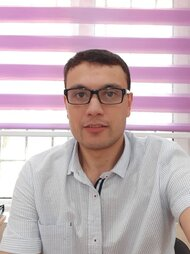

# Ruslanbek Normurodov

Junior Front End Developer



## Contacts:

☎️ +998 99 457 08 92

📧 aksirus89@gmail.com

:octocat: @ruslanbek92

🏠 Tashkent, Uzbekistan

## Quick info about myself

Honest and hardworking Front End developer with the aim to become a great web developer.

## Skills

- HTML, CSS, Javascript
- Boostrap, React
- Git and GitHub
- gulp, parcel.

## Code example

```
function multiply(a, b){
  return a * b
}
```

## Experience

- Have done internship at Eurosoft IT Company for two month.
- Have been teaching kids Front End at Teaching Center for 3 months.
- Independently have finished challenge from Front End Mentor: [Space Tourism Website] (https://musing-archimedes-0fbb66.netlify.app/)

## Education

- Diploma on Software Engineering, NIIT New Delhi India
- Front End Course from Mozilla Developer Network
- FreeCodeCamp Front End Course

## English

B2

I have worked as an english-uzbek interpreter for medical tourists in India.
